# G4_Promoter_Pipeline

**A reproducible Snakemake workflow for promoter-centric G-quadruplex and R-loop analysis of CUT&Tag and RNA-seq data.**

[](LICENSE)
[](https://snakemake.readthedocs.io)
[](https://www.r-project.org/)
<!-- [](https://doi.org/10.5281/zenodo.XXXXXXX) -->

This workflow takes public G-quadruplex (BG4) and R-loop (S9.6) CUT&Tag coverage tracks together
with an RNA-seq count table from wild-type, **DHX36** knockout, **FANCJ** knockout and
double-knockout mouse embryonic stem cells, and runs the complete analysis end to end: differential
expression, replicate-aware peak calling, region-resolved enrichment, RNA × chromatin integration,
sequence-level G-quadruplex **topology** assignment, and promoter-focused metaprofiles down to
individual G4 motifs.

Everything derives from public data (GEO **GSE269081**, **GSE269082**, **GSE269084**). One command
fetches the inputs, one command reproduces every figure and table. Fifty numbered scripts, 51
Snakemake rules, one configuration file, no hidden state.

---

## Contents

- [Biological system](#biological-system)
- [What the workflow does](#what-the-workflow-does)
- [Repository layout](#repository-layout)
- [Data availability](#data-availability)
- [Installation](#installation)
- [Running the workflow](#running-the-workflow)
- [Configuration](#configuration)
- [Outputs](#outputs)
- [Selected results](#selected-results)
- [Reproducibility notes](#reproducibility-notes)
- [Citation](#citation)
- [License](#license)

---

## Biological system

| Property | Value |
|---|---|
| Cell type | Mouse embryonic stem cells (mESCs) |
| Reference genome | mm10 (GRCm38), chr1–19 + chrX |
| Annotation | `TxDb.Mmusculus.UCSC.mm10.knownGene`, `org.Mm.eg.db`, GENCODE vM25, ENCODE SCREEN V3 cCREs |
| Assays | G4 CUT&Tag (BG4 antibody, 3 replicates) · R-loop CUT&Tag (S9.6 antibody, 2 replicates) · RNA-seq (CEL-seq2, 3 replicates) |

**DHX36** (RHAU/G4R1) and **FANCJ** (BRIP1) are helicases that unwind G-quadruplexes. Removing them
individually and together tests how much of the steady-state G4 and R-loop landscape — especially at
promoters — depends on active resolution.

### Genotypes and the clone codes in the filenames

The GEO bigWig filenames use clone identifiers rather than genotype names. The workflow maps them in
[`scripts/_shared/helpers.R`](scripts/_shared/helpers.R):

| Genotype | Clone code in filename | Description |
|---|---|---|
| `WT` | `WT` | wild type |
| `DHX36KO` | `P2D2` | DHX36 knockout |
| `FANCJKO` | `D1D6` | FANCJ knockout |
| `dKO` | `P3D4` | DHX36 / FANCJ double knockout |
| `ERCCWT`, `ERCCKO` | `ERCCWT`, `ERCCKO` | ERCC1 wild-type / knockout CUT&Tag, used only as an independent control peak set (excluded from the main comparisons) |

RNA-seq count-table columns use a third convention (`WT`, `D`, `J`, `DJ`), mapped by
`rnaseq.sample_map` in [`config/config.yaml`](config/config.yaml).

---

## What the workflow does

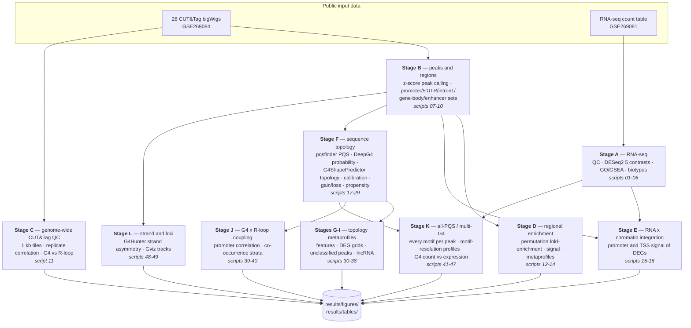

### Stage detail

| Stage | Scripts | What happens | Figure themes |
|---|---|---|---|
| **A** RNA-seq | `01`–`06` | Library QC and PCA; DESeq2 across five contrasts with ashr shrinkage (padj < 0.05, \|log2FC\| > 0.5); GO:BP and GSEA (Hallmark + targeted DNA-repair/G4/R-loop pathways); gene-biotype resolved volcanoes | `01_qc` `02_deseq2` `03_enrichment` `16_volcano` |
| **B** Peaks + regions | `07`–`10` | 500 bp genome bins → replicate-mean signal → global z-score (z ≥ 2) → peaks present in ≥ 2 replicates, merged across 500 bp gaps; per-genotype and union peak sets; promoter (TSS ± 2 kb), 5′ UTR, first intron, gene body and ENCODE distal-ELS enhancer region sets | `04_peaks` |
| **C** Genome-wide QC | `11` | 1 kb tiles genome-wide (500 k subsampled), signal distributions, replicate correlation, G4-vs-R-loop scatter per genotype | `05_cuttag` |
| **D** Regional enrichment | `12`–`14` | Permutation-based fold enrichment of peaks in each region class, regional signal distributions, ±2 kb metaprofiles (80 bins), plus a full-peak validation metaprofile | `06_regional` |
| **E** Integration | `15`–`16` | Promoter (± 2 kb) CUT&Tag signal split by DEG direction; TSS ± 5 kb profiles (100 bins) for the top 500 up- and down-regulated genes per KO-vs-WT contrast | `07_integration` |
| **F** Topology core | `17`–`29` | 201 bp peak-summit sequences + GC-matched background; DeepG4 formation probability; pqsfinder PQS detection (score ≥ 20); G4ShapePredictor topology (parallel / antiparallel / hybrid) at 0.80 precision; loop-length heuristic cross-check; literature-control calibration sweep; differential gain/loss (voom); propensity metrics; genomic-feature partition; R-loop coupling; promoter-G4 vs expression | `08_topology` `09_gain_loss` `10_metaprofiles` `11_propensity` `12_feature` `13_rloop` `14_expression` |
| **G** Topology metaprofiles | `30`–`34` | Topology-resolved BG4 profiles at promoters, 5′ UTRs, first introns and enhancers; DEG × topology grids; totals across features | `10_metaprofiles` |
| **H** Unclassified peaks | `35`–`37` | Peaks with no canonical PQS: signal profiles, sequence and repeat context (RepeatMasker), JASPAR motif enrichment | `15_unclassified` |
| **I** lncRNA | `38` | G4 occupancy at lncRNA TSSs (GENCODE vM25 biotypes), split by DEG status and gain/loss | `17_lncrna` |
| **J** G4 × R-loop | `39`–`40` | Promoter-level G4 vs R-loop signal correlation (background-median normalised, z-scored, hexbin) and co-occurrence strata with heatmaps | `18_g4_rloop_correlation` `19_g4_rloop_cooccurrence` |
| **K** All-PQS / multi-G4 | `41`–`47` | Every PQS per peak (overlapping registers collapsed), motif-resolution topology, motif density vs per-motif signal at TSSs, G4-count-per-promoter vs expression and KO response | `20_motif_distributions` `21_multiG4_expression` |
| **L** Strand + loci | `48`–`49` | G4Hunter net-G-richness strand asymmetry (±250/500 bp, binomial tests, BH-adjusted) and strand-split metaprofiles; Gviz multi-track locus figures | `22_strand` `23_gviz` |

One rule per numbered script, all wired into a single `rule all` — see [`Snakefile`](Snakefile).

---

## Repository layout

```
G4_Promoter_Pipeline/
├── Snakefile                     # 51 rules + rule all; one rule per numbered script
├── config/config.yaml            # every path, threshold and parameter
├── scripts/
│   ├── _shared/helpers.R         # shared helper library (bigWig I/O, peak calling,
│   │                             #   profiles, genotype/clone mapping, plot themes)
│   ├── 01_*.R … 49_*.R           # analysis steps in DAG order
│   ├── 20_g4sp_topology.py       # G4ShapePredictor topology (g4sp conda env)
│   ├── 26a_*.py, 26b_*.py        # threshold sweep + literature-control benchmark
│   ├── download_data.ps1         # fetch inputs from GEO (Windows)
│   └── download_data.sh          # fetch inputs from GEO (Linux/macOS/WSL)
├── envs/
│   ├── install_r_packages.R      # installs the CRAN/Bioconductor/GitHub R stack
│   ├── r_g4.yaml                 # conda R env (Linux/WSL only — see Installation)
│   ├── g4sp.yaml                 # G4ShapePredictor python env (pinned sklearn 1.0.2)
│   └── deepg4.yaml               # DeepG4 / TensorFlow env (Linux/WSL only)
├── data/
│   ├── geo_manifest.tsv          # the 28 CUT&Tag samples: accession, size, metadata
│   ├── known_topology_controls.tsv   # 11 literature-validated control G4s
│   ├── bigwig/                   # ← downloaded (git-ignored, ~3.4 GB)
│   └── rnaseq/                   # ← downloaded (git-ignored)
├── docs/figures/                 # showcase PNGs used in this README
├── results/
│   ├── figures/NN_theme/         # generated: PDF + PNG at 300 dpi (git-ignored)
│   └── tables/                   # generated; the small summary tables are committed
├── cache/                        # generated intermediates: RDS, FASTA (git-ignored)
├── logs/NN_*.log                 # generated: one log per rule (git-ignored)
└── external/                     # G4ShapePredictor clone (git-ignored)
```

Committed vs generated: the repository tracks the workflow, the curated control table, the GEO
manifest, the small summary tables from the v1.0.0 run and the showcase figures. Inputs, caches,
logs, the full figure set and the large motif catalogues (up to 89 MB each) are reproduced by running
the pipeline.

---

## Data availability

All input data are public. Nothing in this repository needs restricted access.

| Dataset | Accession | What it provides |
|---|---|---|
| RNA-seq | [GSE269081](https://www.ncbi.nlm.nih.gov/geo/query/acc.cgi?acc=GSE269081) | `GSE269081_count_table.tsv` — 12 libraries × gene counts |
| G4 + R-loop CUT&Tag | [GSE269082](https://www.ncbi.nlm.nih.gov/geo/query/acc.cgi?acc=GSE269082) | subseries of the CUT&Tag samples |
| Series | [GSE269084](https://www.ncbi.nlm.nih.gov/geo/query/acc.cgi?acc=GSE269084) | all 28 bigWig coverage tracks |

Source study: *Sato et al.*, "RNA transcripts regulate G-quadruplex landscapes through G-loop
formation". Please cite it whenever you use these data.

### Sample inventory

The 28 tracks and their expected sizes are listed in [`data/geo_manifest.tsv`](data/geo_manifest.tsv):

| Assay | Antibody | Genotypes | Replicates | Files | Accessions |
|---|---|---|---|---|---|
| G4 CUT&Tag | BG4 | WT, DHX36KO, FANCJKO, dKO | 3 | 12 (~1.5 GB) | GSM8305989–GSM8306000 |
| R-loop CUT&Tag | S9.6 | WT, DHX36KO, FANCJKO, dKO | 2 | 8 (~125 MB) | GSM8306001–GSM8306008 |
| G4 + R-loop CUT&Tag | BG4, S9.6 | ERCCWT, ERCCKO (controls) | 2 | 8 (~1.3 GB) | GSM8785590–GSM8785597 |
| RNA-seq | — | WT, DHX36KO, FANCJKO, dKO | 3 | 1 count table | GSE269081 |

### Downloading

```powershell
# Windows PowerShell, from the repository root
.\scripts\download_data.ps1                 # 28 bigWigs + count table  (~3.4 GB)
.\scripts\download_data.ps1 -Refs           # ...plus GENCODE GTF and mm10 RepeatMasker
.\scripts\download_data.ps1 -WhatIf         # show the plan, download nothing
```

```bash
# Linux / macOS / WSL
scripts/download_data.sh                    # 28 bigWigs + count table
scripts/download_data.sh --refs             # ...plus reference annotations
scripts/download_data.sh --dry-run          # show the plan
```

Both scripts verify each file against the byte sizes in the manifest, skip files that are already
complete, resume interrupted transfers, and clone
[G4ShapePredictor](https://github.com/donn-liew/G4ShapePredictor) into `external/`. All 28 bigWigs
are needed for a full run — the ERCC tracks feed the control peak sets that `rule all` requires.

**Already have the tracks?** Don't copy them. Point the workflow at them with a local overlay —
`--configfile` merges recursively, so you only list the paths you want to change:

```bash
cp config/config.local.example.yaml config/config.local.yaml   # then edit the paths
snakemake --cores 4 --configfile config/config.local.yaml
```

(`config/config.local.yaml` is git-ignored. Plain `--config paths.bigwig_dir=…` does *not* work:
Snakemake's `--config` only accepts top-level keys.)

Alternatively, on Windows, link the directory in place (the junction is git-ignored):

```powershell
New-Item -ItemType Junction -Path data\bigwig -Target D:\path\to\existing\bigwigs
```

Reference annotations (GENCODE vM25 GTF, mm10 RepeatMasker, ENCODE cCREs) download themselves on
first use if absent; `-Refs`/`--refs` just front-loads the two large ones.

---

## Installation

The workflow was developed and run on **native Windows 11** with **system R 4.5.1**, **Snakemake
9.22** and three small conda environments. Bioconda publishes no Windows builds of the Bioconductor
genomics stack, so on Windows the R packages must come from your system R rather than from conda —
this is why the rules call `Rscript` directly and the workflow runs **without** `--use-conda`.

**1. R packages** (CRAN + Bioconductor + DeepG4 from GitHub):

```bash
Rscript envs/install_r_packages.R            # install what is missing
Rscript envs/install_r_packages.R --check    # report only
```

**2. Snakemake runner environment** (any recent Snakemake ≥ 7; 9.22 tested):

```bash
conda create -n G4 -c conda-forge -c bioconda snakemake
```

**3. G4ShapePredictor python environment** — the pins are load-bearing:

```bash
conda env create -f envs/g4sp.yaml           # python 3.9, scikit-learn 1.0.2, numpy<2
```

The published G4ShapePredictor model pickles were trained with scikit-learn 1.0.2, whose
decision-tree node dtype changed in 1.3. A newer scikit-learn cannot unpickle them and the topology
rule silently falls back to the loop-length heuristic. Do not relax these pins — see the comments in
[`envs/g4sp.yaml`](envs/g4sp.yaml).

**4. TensorFlow for DeepG4** (optional, one rule): an env named `tf-new` with TensorFlow 2.13 /
Keras 2.13 / python 3.8, reached through `reticulate`. Configured by `deepg4.reticulate_condaenv`.
If DeepG4 or TensorFlow is unavailable, only the ROC sanity check (script `22`) is lost — the
topology branch completes on pqsfinder + G4ShapePredictor.

**On Linux/WSL** you can take the conda route for everything instead:

```bash
conda env create -f envs/r_g4.yaml
conda env create -f envs/deepg4.yaml
conda env create -f envs/g4sp.yaml
```

---

## Running the workflow

```bash
conda activate G4
snakemake -n                # dry run: resolves the DAG, checks inputs exist
snakemake --cores 4         # full run (do NOT pass --use-conda on Windows)
```

Useful invocations:

```bash
snakemake --cores 4 call_peaks                       # one rule and its dependencies
snakemake --cores 4 results/figures/08_topology/topology_counts.pdf   # one target
snakemake --dag | dot -Tsvg > dag.svg                # render the DAG
snakemake --cores 4 --rerun-incomplete               # after an interruption
```

**Smoke test.** Set `peak_subsample: 2000` in `config/config.yaml` to shrink the union peak set, run
the whole DAG in a fraction of the time, then set it back to `null` for the real run (and delete
`cache/` so full-size intermediates are rebuilt).

### Resources

| | |
|---|---|
| Disk | ~3.4 GB inputs (+170 MB reference annotations), ~0.4 GB `cache/`, ~0.5 GB `results/` |
| Memory | Peak calling and genome-wide binning dominate; genome tiles are subsampled (`genomewide.subsample: 500000`) and peak calling evicts per genotype to stay within a normal workstation |
| Time | Budget an overnight run from an empty `cache/` on 4 cores |

Slowest rules, all cached afterwards:

- `07_call_peaks` — reads all 28 bigWigs and bins the genome; the peak and region caches underpin
  every later stage.
- `41_extract_all_pqs` — pqsfinder across the full 147,843-peak union, ≈ 75 min; cached on union
  size, so downstream reruns are cheap.
- `19_deepg4_predict` — TensorFlow through reticulate; the most fragile dependency, and the only
  one whose failure costs a single figure rather than the branch.

Network-dependent rules cache after their first success: `09_build_enhancers` (ENCODE cCREs),
`05_gene_biotype` (GENCODE), `36_unclassified_peak_context` (RepeatMasker), `49_gviz_locus_tracks`
(UCSC ideogram — succeeds offline, simply without the ideogram track).

---

## Configuration

Everything tunable lives in [`config/config.yaml`](config/config.yaml); the scripts read nothing
else. The parameters most likely to matter:

| Key | Default | Meaning |
|---|---|---|
| `rnaseq.padj`, `rnaseq.lfc` | 0.05, 0.5 | DEG significance thresholds |
| `rnaseq.contrasts` | 5 pairs | DESeq2 contrasts, as `[numerator, denominator]` |
| `peak_calling.bin_size`, `z_thresh` | 500 bp, 2 | genome bin width and z-score peak cutoff |
| `peak_calling.min_replicates` | 2 | replicates a bin must pass in (3 G4 / 2 R-loop reps) |
| `regions.promoter_up/down` | 2000, 2000 | promoter window around the TSS |
| `pqsfinder.min_score` | 20 | minimum PQS score kept |
| `g4sp.precision` | 0.80 | G4ShapePredictor precision-optimised threshold |
| `metaprofile.half_width`, `n_bins` | 2000, 80 | metaprofile window and resolution |
| `differential.voom_padj`, `voom_lfc` | 0.1, 0.585 | gain/loss significance for peak signal |
| `genomewide.subsample` | 500000 | 1 kb tiles retained for genome-wide QC |
| `peak_subsample` | `null` | set to e.g. 2000 for a fast end-to-end smoke test |

Top-level keys can be overridden on the command line — `snakemake --cores 4 --config
peak_subsample=2000`. For nested keys use an overlay file
([`config/config.local.example.yaml`](config/config.local.example.yaml)) and
`--configfile`, which Snakemake merges recursively into the main config, or just edit
`config/config.yaml`.

---

## Outputs

```
results/figures/NN_theme/*.pdf   # publication vector figures
results/figures/NN_theme/*.png   # 300 dpi rasters (same content)
results/tables/*.{csv,tsv}       # every quantitative result
cache/*.rds                      # peaks, regions, motifs, profiles, DESeq2 objects
logs/NN_*.log                    # one log per rule, stdout + stderr
```

Twenty-three figure themes (`01_qc` … `23_gviz`) map onto the stage table above. The committed
`results/tables/` subset is the actual v1.0.0 output — the small summary tables plus the five DESeq2
contrast tables — so the numbers quoted below can be checked without running anything. Large derived
catalogues (`motif_catalog.csv`, `motif_g4sp_topology.csv`, `peak_catalog.csv`, …) are regenerated
by the workflow.

Key tables: `peak_summary.csv` (peak counts and widths per set), `region_fold_enrichment.tsv`,
`topology_composition.csv`, `sanity_metrics.csv`, `topology_precision_sweep.csv`,
`g4sp_control_benchmark.csv`, `strand_bias_summary.tsv`, `deseq2_results_<contrast>.tsv`,
`significant_DEG_union.tsv`, `go_enrichment_summary.tsv`.

---

## Selected results

Figures below are from the v1.0.0 run and live in [`docs/figures/`](docs/figures/).

### RNA-seq: genotypes separate, dKO carries the transcriptional phenotype

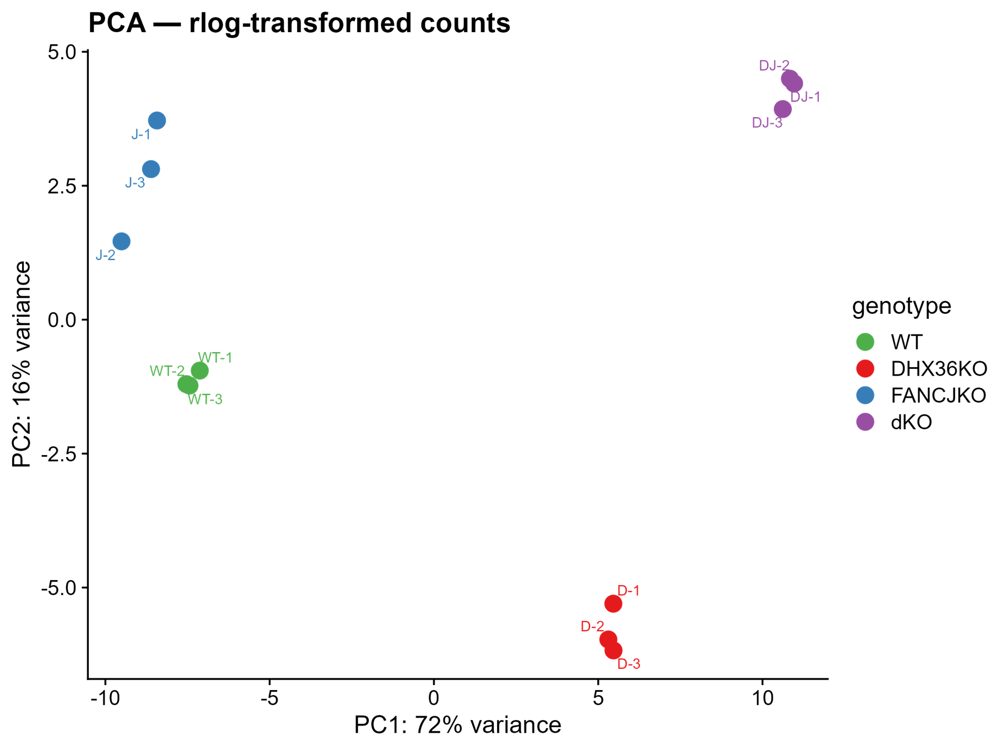 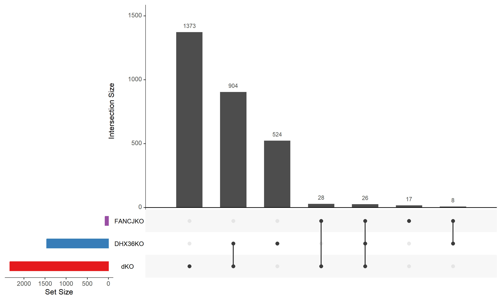

PCA of regularised counts and the overlap of significant DEGs across the three KO-vs-WT contrasts
(padj < 0.05, |log2FC| > 0.5). 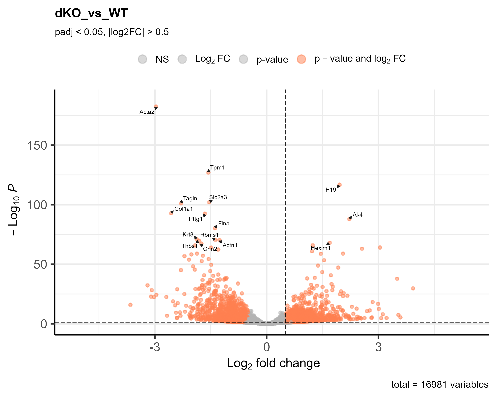

### CUT&Tag: reproducible peaks strongly enriched at promoters, 5′ UTRs and enhancers

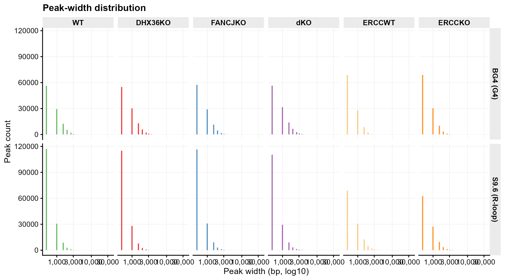 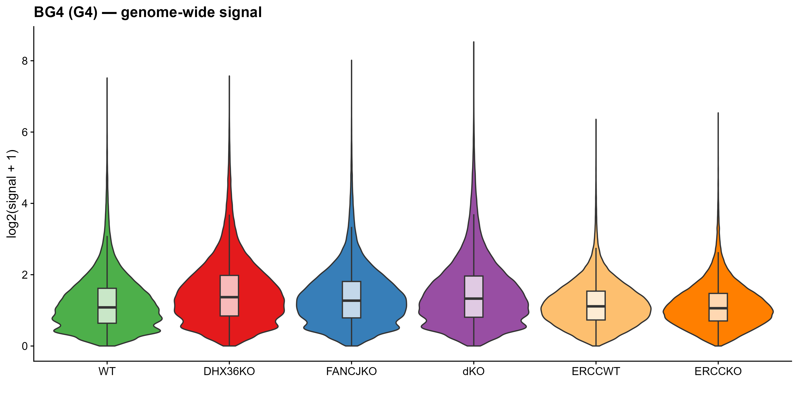

The z-score caller yields ~105–114 k G4 peaks per genotype (mean ~0.9 kb; 147,843 in the union) and
~156–162 k R-loop peaks. Permutation enrichment puts BG4 peaks **~12× over expectation in 5′ UTRs**,
**~5.6× in distal enhancers** and **~2× at promoters**, while R-loop peaks are essentially unenriched
at promoters (~1.0×) — and the ERCC1 control tracks reach only ~1.3× at promoters, confirming the
signal is antibody-specific rather than an artefact of the calling procedure.

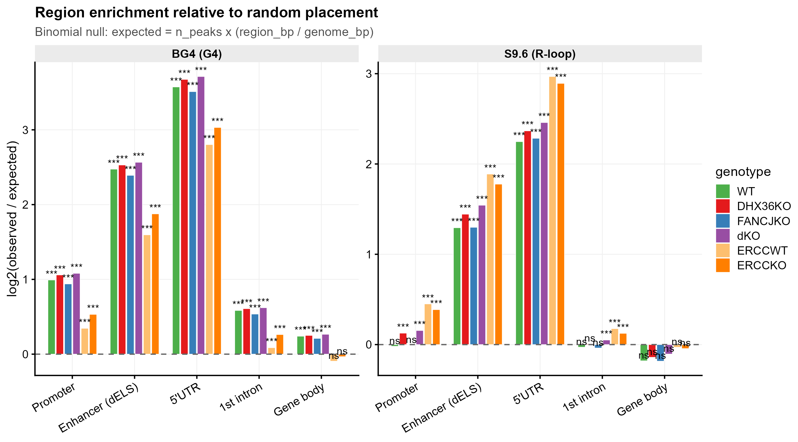

### Topology: promoter G4s are overwhelmingly parallel

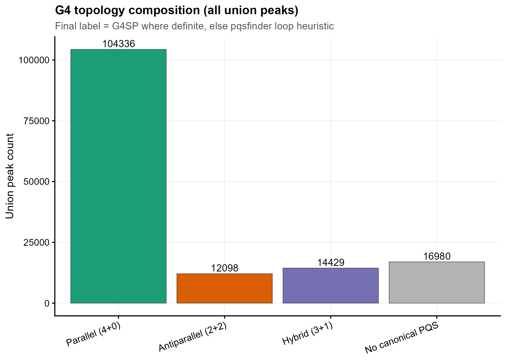 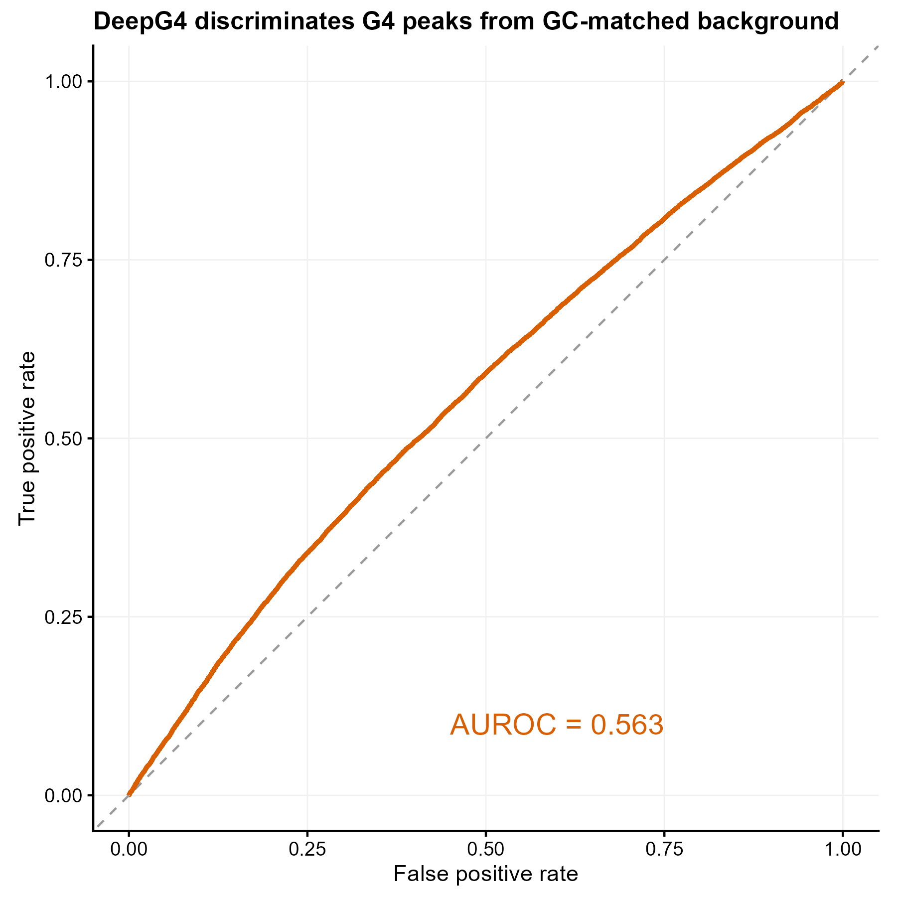

Combining pqsfinder with G4ShapePredictor at 0.80 precision assigns, in WT, **72.9 % parallel**,
10.0 % hybrid, 7.9 % antiparallel and 9.1 % of peaks with no canonical PQS — a composition that
barely shifts across genotypes (`topology_composition.csv`). DeepG4 scores peaks above GC-matched
background with AUROC 0.56 (`sanity_metrics.csv`), an independent but deliberately weak sanity
check rather than a classifier.

### Integration, G4 × R-loop coupling, and multi-G4 promoters

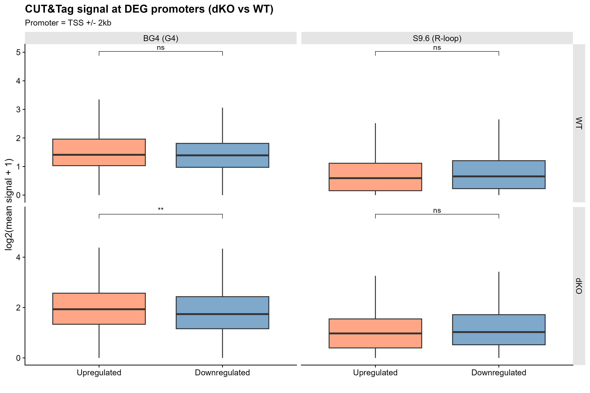 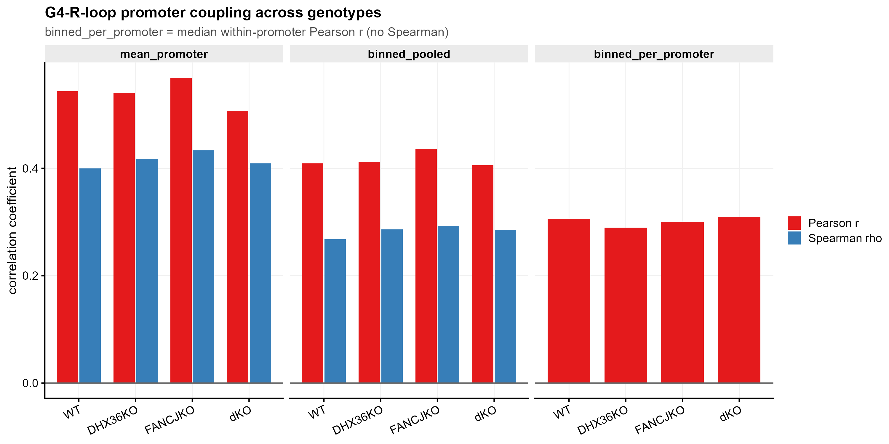

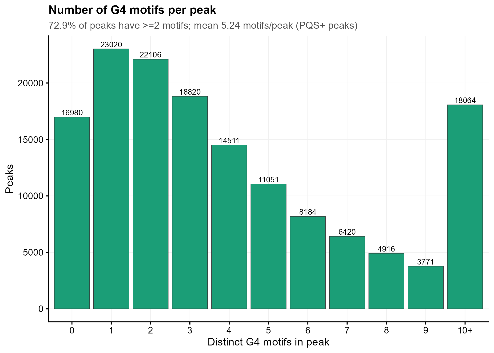 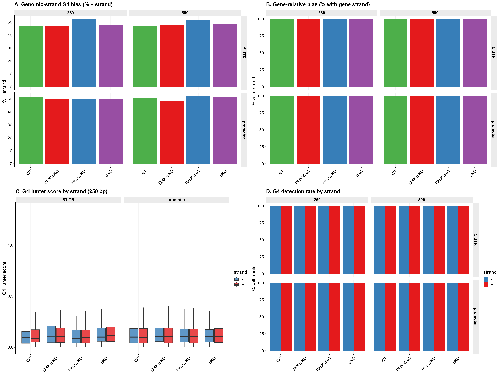

Counting **every** PQS per peak rather than only the top-scoring one shows that 73 % of peaks carry
≥ 2 distinct G4 loci (`motif_count_distribution.csv`), which is why Stage K repeats the promoter
analyses at motif resolution. G4Hunter strand asymmetry at promoters and 5′ UTRs is symmetric within
noise across all genotypes and both window sizes (`strand_bias_summary.tsv`).

---

## Reproducibility notes

- **Full rebuild.** Delete `cache/` and rerun: every intermediate is derived from the bigWigs and the
  count table, so the workflow reproduces from public data alone.
- **Determinism.** Every subsampling step has an explicit seed in `config/config.yaml`
  (`subsample_seed`, `region_signal_seed`, `profile_seed`, `background_seed`, `strand.seed`).
  Results are reproducible given the same package versions; `sessionInfo()` is recorded in the logs.
- **Graceful degradation.** DeepG4/TensorFlow failure costs only the rule-22 ROC. Running offline
  costs only the Gviz ideogram track. A wrong scikit-learn version in the `g4sp` env makes the
  topology rule fall back to the loop-length heuristic — check `logs/20_g4sp_topology.log` if
  topology proportions look unexpected.
- **Provenance.** One rule per numbered script, one log per rule, and the header of every script
  documents its inputs, outputs and the parameters it consumes.

---

## Citation

If this workflow contributes to your work, please cite both the software and the source data.

```bibtex
@software{goodall_g4_promoter_pipeline,
  author  = {Goodall, Daniel J.},
  title   = {{G4\_Promoter\_Pipeline}: a Snakemake workflow for promoter-centric
             G-quadruplex and R-loop analysis of CUT\&Tag and RNA-seq data},
  version = {1.0.0},
  year    = {2026},
  url     = {https://github.com/DJ-Goodall/G4_Promoter_Pipeline}
}
```

Machine-readable metadata: [`CITATION.cff`](CITATION.cff) and [`.zenodo.json`](.zenodo.json).
Data: GEO GSE269081 / GSE269082 / GSE269084 (*Sato et al.*). Third-party tools and reference data,
with their licences and citations: [`THIRD_PARTY.md`](THIRD_PARTY.md).

---

## License

Code — [MIT](LICENSE). Committed figures and derived tables — CC-BY-4.0, see
[`LICENSE-DATA.md`](LICENSE-DATA.md). Third-party software and reference data are not
redistributed here and keep their own terms ([`THIRD_PARTY.md`](THIRD_PARTY.md)).

## Acknowledgements

Built on [DeepG4](https://github.com/raphaelmourad/DeepG4),
[G4ShapePredictor](https://github.com/donn-liew/G4ShapePredictor),
[pqsfinder](https://bioconductor.org/packages/pqsfinder/), the Bioconductor genomics stack, and
public reference data from GENCODE, ENCODE SCREEN and the UCSC Genome Browser.
